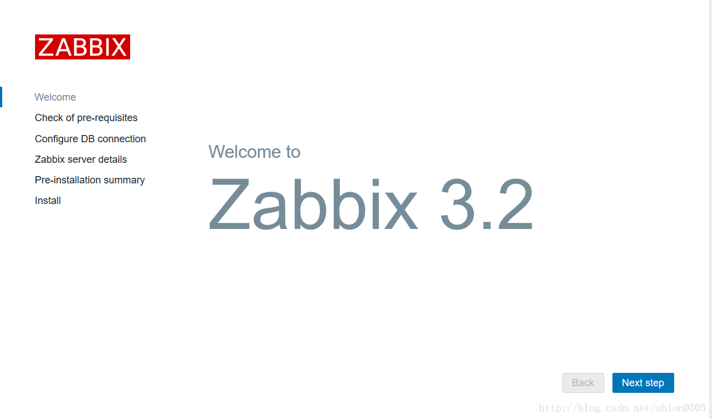
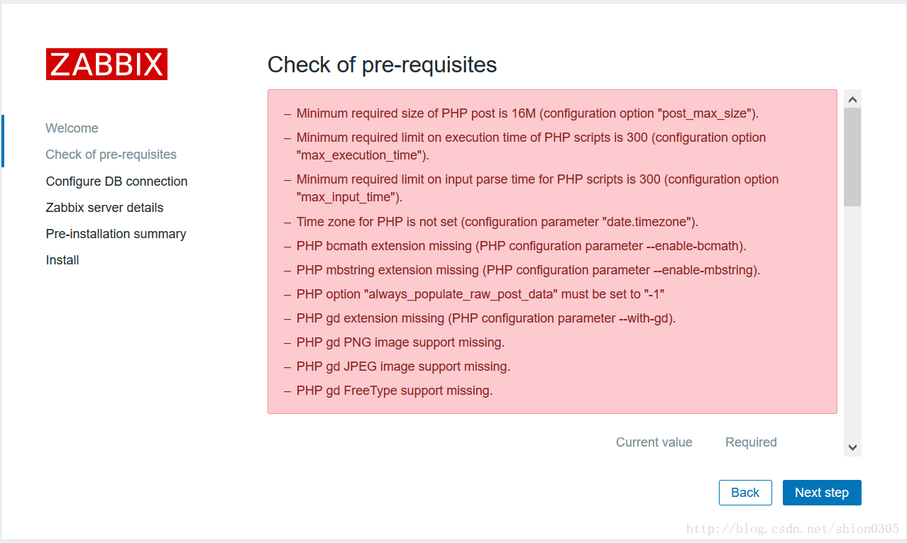
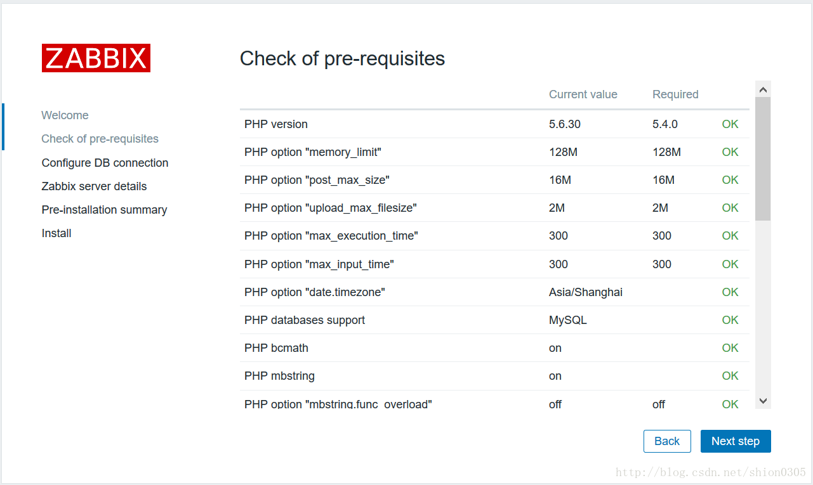
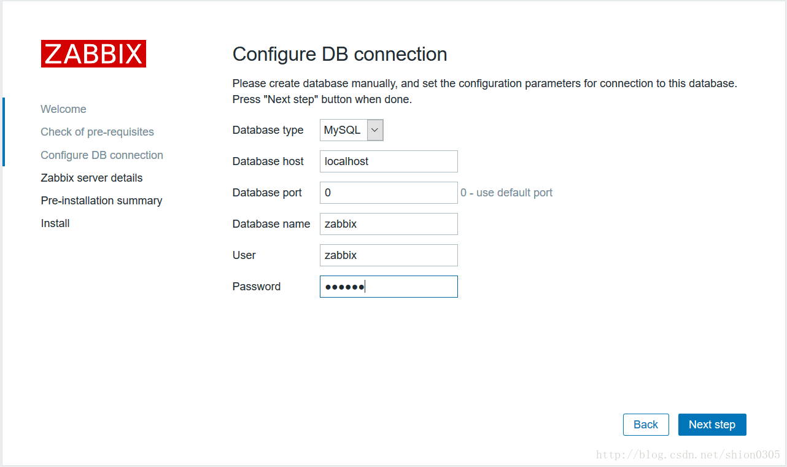
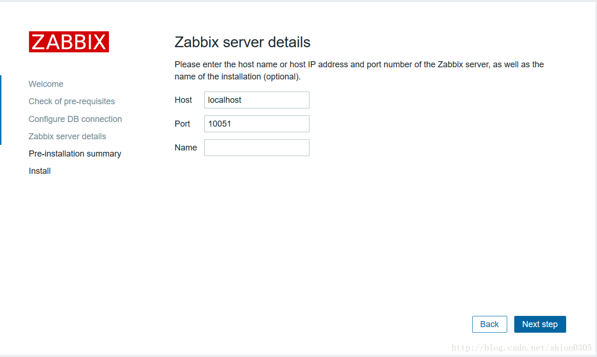
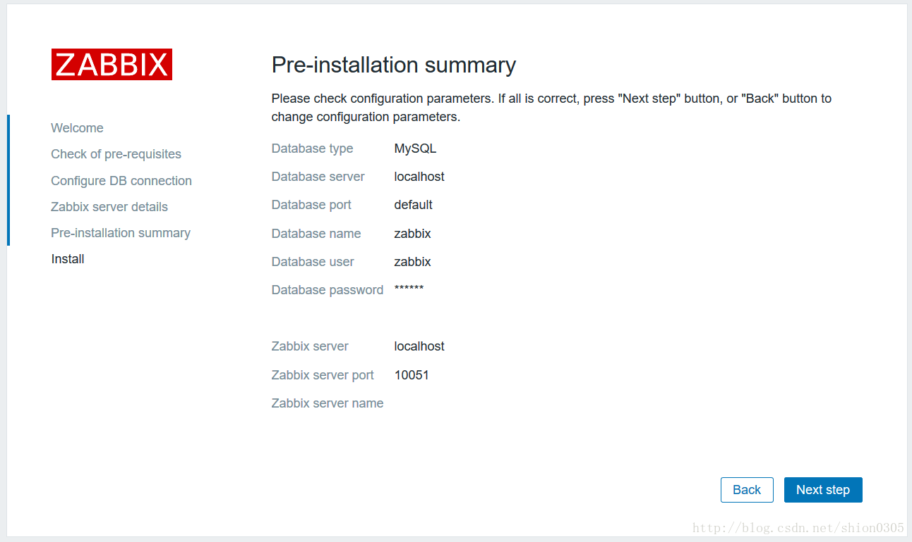
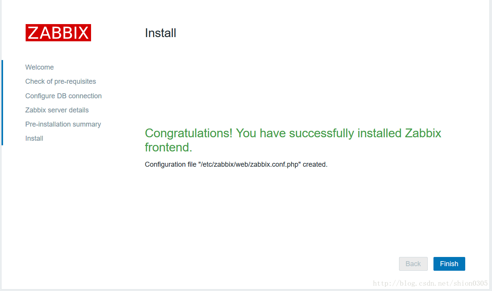
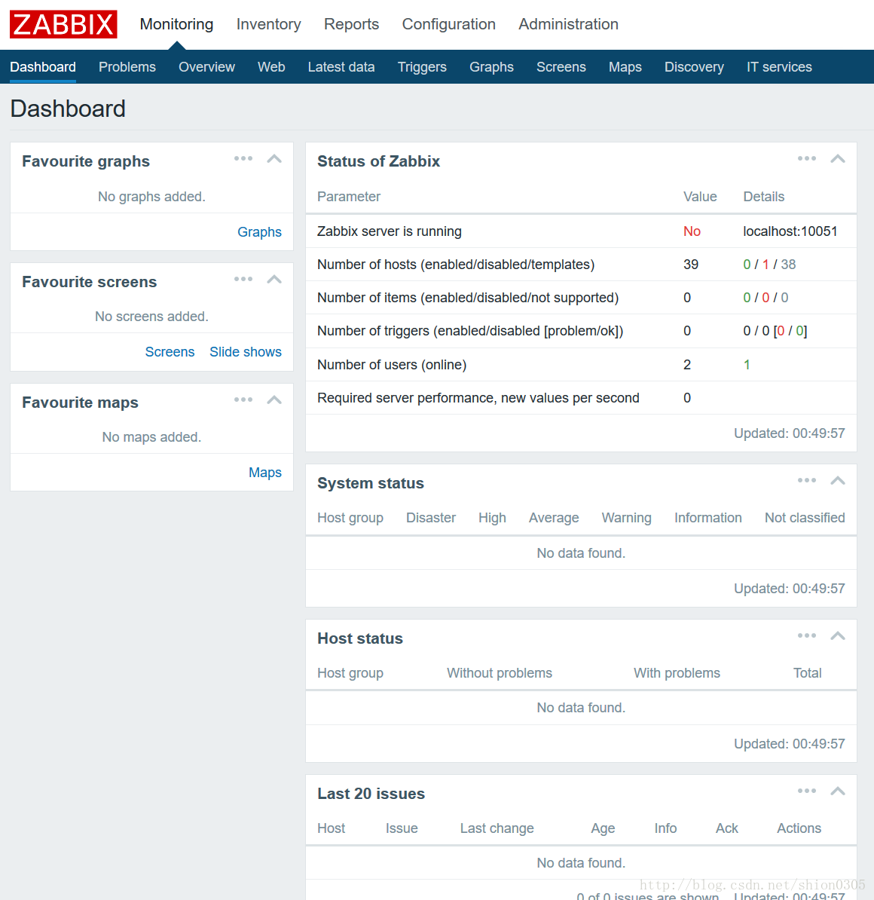

## 1. **安装虚拟机**

虚拟机配置：
1 核 2G，20G 硬盘

安装时选择的服务包：

- 在 `base system` 中选择 `base`、`large systems performance`、`legacy unix compatibility`
- `database` 中选择 `mysql database client`、`mysql database server`
- `desktops` 全选
- `languages` 中选择 `Chinese support`
- `servers` 中选择 `server platform`、`system administration tools`
- `system management` 中选择 `snmp support`
- `web services` 中选择 `php support`、`web server`、`web servlet engine`

## 2. **配置yum源**

安装 epel 源

```shell
[root@localhost ~]# yum -y install epel-release
```

安装 webtatic 源

```shell
[root@localhost ~]# rpm -Uvh http://mirror.webtatic.com/yum/el6/latest.rpm
Retrieving http://mirror.webtatic.com/yum/el6/latest.rpm
warning: /var/tmp/rpm-tmp.LS63Uk: Header V4 DSA/SHA1 Signature, key ID cf4c4ff9: NOKEY
Preparing...                ########################################### [100%]
   1:webtatic-release       ########################################### [100%]

```

配置 Zabbix 源

```shell
vim /etc/yum.repos.d/zabbix.repo
[zabbix]
name=zabbix
baseurl=http://repo.zabbix.com/zabbix/3.2/rhel/6/x86_64/
enabled=1
gpgcheck=0

[zabbix-deprecated]
name=zabbix-deprecated
baseurl=http://repo.zabbix.com/zabbix/3.2/rhel/6/x86_64/deprecated/
enabled=1
gpgcheck=0
```

清空 yum cache，重建 yum 缓存

```shell
[root@localhost ~]# yum clean all
[root@localhost ~]# yum repolist
[root@localhost ~]# yum makecache
```

## 3. **升级PHP版本**

由于 Zabbix 3.2 版本需要 PHP 5.6 以上版本才能支持，默认 CentOS 安装的 PHP 版本为 5.3.3，因此需要升级 PHP 版本。

查看当前 php 版本

```shell
[root@localhost ~]# php -v
```

移除当前已经安装的 php 版本

```shell
[root@localhost ~]# yum remove php*
```

安装 php 5.6 版本

```shell
[root@localhost ~]# yum install php56w php56w-devel php56w-common php56w-mysql php56w-pdo php56w-opacache php56w-xml

[root@localhost ~]# php -v
PHP 5.6.30 (cli) (built: Jan 19 2017 22:50:24) 
Copyright (c) 1997-2016 The PHP Group
Zend Engine v2.6.0, Copyright (c) 1998-2016 Zend Technologies
```

## 4. 编辑mysql配置文件

编辑 `/etc/my.cnf`{: .filepath} ，添加以下内容，防止中文乱码

```shell
[root@localhost ~]# vim /etc/my.cnf 

#设置字符集为utf8
character-set-server=utf8

#让innodb的每个表文件单独存储
innodb_file_per_table=1
```

启动 mysql 服务，并设置开机自动启动

```shell
[root@localhost ~]# service mysqld start
[root@localhost ~]# chkconfig mysqld on
```

设置 mysql 服务 root 密码

```shell
[root@localhost ~]# mysqladmin -uroot password root
```

创建数据库和用户授权

```shell
[root@localhost ~]# mysql -uroot -proot
Welcome to the MySQL monitor.  Commands end with ; or \g.
Your MySQL connection id is 3
Server version: 5.1.71 Source distribution

Copyright (c) 2000, 2013, Oracle and/or its affiliates. All rights reserved.

Oracle is a registered trademark of Oracle Corporation and/or its
affiliates. Other names may be trademarks of their respective
owners.

Type 'help;' or '\h' for help. Type '\c' to clear the current input statement.

mysql> create database zabbix character set utf8
    -> ;
Query OK, 1 row affected (0.00 sec)

mysql> grant all privileges on zabbix.* to zabbix@'localhost' identified by 'zabbix';
Query OK, 0 rows affected (0.00 sec)

mysql> grant all privileges on zabbix.* to zabbix@'192.168.159.%' identified by 'zabbix';
Query OK, 0 rows affected (0.00 sec)

mysql> flush privileges;
Query OK, 0 rows affected (0.00 sec)

mysql> exit
Bye
```

## 5. **安装 zabbix**

yum 安装 zabbix

```shell
[root@localhost ~]# yum install zabbix-agent zabbix-get zabbix-java-gateway zabbix-proxy zabbix-proxy-mysql zabbix-release zabbix-sender zabbix-server zabbix-server-mysql zabbix-web zabbix-web-mysql
```

解压 sql 导入文件

```shell
[root@localhost ~]# cd /usr/share/doc/zabbix-server-mysql-3.2.4/

[root@localhost zabbix-server-mysql-3.2.4]# ls
AUTHORS  ChangeLog  COPYING  create.sql.gz  NEWS  README

[root@localhost zabbix-server-mysql-3.2.4]# gunzip create.sql.gz 

[root@localhost zabbix-server-mysql-3.2.4]# ls
AUTHORS  ChangeLog  COPYING  create.sql  NEWS  README
```

将 sql 文件导入 mysql

```shell
[root@localhost zabbix-server-mysql-3.2.4]# mysql -uzabbix -pzabbix
Welcome to the MySQL monitor.  Commands end with ; or \g.
Your MySQL connection id is 4
Server version: 5.1.71 Source distribution

Copyright (c) 2000, 2013, Oracle and/or its affiliates. All rights reserved.

Oracle is a registered trademark of Oracle Corporation and/or its
affiliates. Other names may be trademarks of their respective
owners.

Type 'help;' or '\h' for help. Type '\c' to clear the current input statement.

mysql> use zabbix;
Database changed

mysql> source /usr/share/doc/zabbix-server-mysql-3.2.4/create.sql ;

mysql> show tables;

mysql> exit;
```

编辑 `/etc/zabbix/zabbix_server.conf`{: .filepath}

```conf
修改 DBPassword 配置项
DBPassword=zabbix
```
{: file='/etc/zabbix/zabbix_server.conf'}

创建需要的目录

```shell
mkdir /etc/zabbix/alertscripts /etc/zabbix/externalscripts
```

启动zabbix服务

```shell
[root@localhost ~]# setenforce 0
[root@localhost ~]# getenforce 
Permissive
[root@localhost ~]# service zabbix-server restart
Shutting down Zabbix server:                               [FAILED]
Starting Zabbix server:                                    [  OK  ]
[root@localhost ~]# service zabbix-server status
zabbix_server (pid  8693) is running...
[root@localhost ~]# chkconfig zabbix-server on
```

## 6. **配置 apache 服务，并启动**

编辑`/etc/httpd/conf/httpd.conf`{: .filepath}，修改以下内容

```conf
修改 ServerName 项
ServerName localhost:80
```
{: file='/etc/httpd/conf/httpd.conf'}

启动 httpd 服务，并开机自动启动

```shell
[root@localhost ~]# service httpd start
Starting httpd:                                            [  OK  ]
[root@localhost ~]# chkconfig httpd on
```

其他配置

```shell
停止iptables
[root@localhost ~]# service iptables stop
iptables: Setting chains to policy ACCEPT: filter          [  OK  ]
iptables: Flushing firewall rules:                         [  OK  ]
iptables: Unloading modules:                               [  OK  ]

将/usr/share/目录下的zabbix目录复制到/var/www/html/目录下
cp -r /usr/share/zabbix /var/www/html/
```

## 7. **在浏览器中打开并继续配置 zabbix**

1. 在浏览器中打开`http://192.168.159.253/zabbix`

    {: width="1280" height="754" .w-80 .shadow}

2. 点击下一步，此页为php的参数检测，如果不通过，就修改到通过为止，在 `/etc/php.ini`{: .filepath} 那里修改，记得改完要重启 http

    {: width="1278" height="766" .w-80 .shadow}

3. 修改php配置文件`/etc/php.ini`{: .filepath}

    ```conf
    post_max_size = 16M
    max_execution_time = 300
    max_input_time = 300
    date.timezone = Asia/Shanghai
    bcmath.scale = 1
    always_populate_raw_post_data = -1
    #修改以上参数后保存退出
    ```
    {: file='/etc/php.ini'}

    ```bash
    #安装php插件bcmath、mbstring、gd
    [root@localhost ~]# yum install -y php56w-gd php56w-bcmath php56w-mbstring

    #重启httpd服务
    [root@localhost ~]# service httpd restart
    ```

4. 点击 `back` ，重新点击下一步检查

    {: width="1281" height="766" .w-80 .shadow}

5. 点击下一步，mysql 数据库检测，用户名和密码填写刚才创建的 `zabbix`

    {: width="1282" height="761" .w-80 .shadow}

6. 点击下一步，此页保持默认

    {: width="1277" height="764" .w-80 .shadow}

7. 信息总览

    {: width="1292" height="770" .w-80 .shadow}

8. 安装完毕，点击`finish`即可完成安装。

    {: width="1286" height="761" .w-80 .shadow}

9. 登录，默认用户名密码为`admin`/`zabbix`

    {: width="1191" height="728" .w-80 .shadow}

    {: width="1160" height="1194" .w-80 .shadow}
