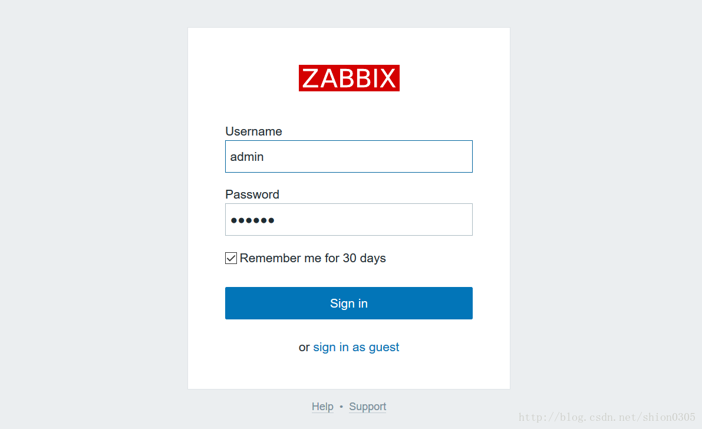

## 1. **安装虚拟机**

此处不做赘述

## 2. **配置 yum 源**

安装 epel 源

```shell
[root@localhost ~]# yum -y install epel-release
```

安装 webtatic 源

```shell
[root@localhost ~]# rpm -Uvh http://mirror.webtatic.com/yum/el7/webtatic-release.rpm
```

配置 zabbix 源

```shell
vim /etc/yum.repos.d/zabbix.repo
[zabbix]
name=zabbix
baseurl=http://repo.zabbix.com/zabbix/3.2/rhel/7/x86_64/
enabled=1
gpgcheck=0
```

清空 yum cache，重建 yum 缓存

```shell
[root@localhost ~]# yum clean all
[root@localhost ~]# yum repolist
[root@localhost ~]# yum makecache
```

## 3. **升级PHP版本**

由于zabbix3.2版本需要PHP5.6以上版本才能支持，默认centos安装的php版本为5.3.3，因此需要升级php版本。

查看当前 php 版本
```shell
[root@localhost ~]# php -v
```

移除当前已经安装的 php 版本
```shell
[root@localhost ~]# yum remove php*
```
安装 php 5.6 版本
```shell
[root@localhost ~]# yum install -y php56w php56w-devel php56w-common php56w-mysql php56w-pdo php56w-opacache php56w-xml php56w-gd php56w-bcmath php56w-mbstring

[root@localhost ~]# php -v
PHP 5.6.30 (cli) (built: Jan 19 2017 22:50:24) 
Copyright (c) 1997-2016 The PHP Group
Zend Engine v2.6.0, Copyright (c) 1998-2016 Zend Technologies
```

## 4. **安装 mariadb 并编辑 mariadb 配置文件**

安装 mariadb

```shell
[root@localhost ~]# yum install -y mariadb-server mariadb-libs mariadb-devel
```

编辑 `/etc/my.cnf.d/server.cnf`{: .filepath} ，添加以下内容，防止中文乱码

```conf
[mysqld]
#设置字符集为utf8
character-set-server = utf8
collation-server = utf8_bin
skip-character-set-client-handshake
skip-external-locking
symbolic-links=0
innodb_buffer_pool_size = 2048M
innodb_log_file_size = 512M
sort_buffer_size = 2M
innodb_additional_mem_pool_size = 30M
innodb_log_buffer_size = 8M
key_buffer_size = 16M
log-bin=mysql-bin
expire_logs_days = 7
server-id=1001
innodb_data_file_path = ibdata1:1G
#让innodb的每个表文件单独存储
innodb_file_per_table
```
{: file='/etc/my.cnf.d/server.cnf'}

启动 mariadb 服务，并设置开机自动启动

```shell
[root@localhost ~]# systemctl start mariadb
[root@localhost ~]# systemctl status mariadb
[root@localhost ~]# systemctl enable mariadb
```

设置 mysql 服务 root 密码

```shell
[root@localhost ~]# mysqladmin -uroot password root
```

创建数据库和用户授权

```shell
[root@localhost ~]# mysql -uroot -proot
```

```sql
MariaDB [(none)]> create database zabbix character set utf8;
Query OK, 1 row affected (0.00 sec)

MariaDB [(none)]> grant all privileges on zabbix.* to zabbix@'localhost' identified by 'zabbix';
Query OK, 0 rows affected (0.02 sec)

MariaDB [(none)]> grant all privileges on zabbix.* to zabbix@'192.168.159.%' identified by 'zabbix';
Query OK, 0 rows affected (0.00 sec)

MariaDB [(none)]> flush privileges;
Query OK, 0 rows affected (0.00 sec)

MariaDB [(none)]> exit
Bye
```

## 5. **安装zabbix**

yum 安装 zabbix

```shell
[root@localhost ~]# yum install -y zabbix-agent zabbix-get zabbix-java-gateway zabbix-proxy zabbix-proxy-mysql zabbix-release zabbix-sender zabbix-server zabbix-server-mysql zabbix-web zabbix-web-mysql
#由于安装zabbix的时候会默认安装一个zabbix-server-pgsql的插件，我们必须把这个插件删掉，后面zabbix才能默认连接mariadb，否则zabbix默认连接pgsql
[root@localhost ~]# yum remove -y zabbix-server-pgsql
```

解压 sql 导入文件

```shell
[root@localhost ~]# cd /usr/share/doc/zabbix-server-mysql-3.2.7/

[root@localhost zabbix-server-mysql-3.2.7]# ls
AUTHORS  ChangeLog  COPYING  create.sql.gz  NEWS  README

[root@localhost zabbix-server-mysql-3.2.7]# gunzip create.sql.gz 

[root@localhost zabbix-server-mysql-3.2.7]# ls
AUTHORS  ChangeLog  COPYING  create.sql  NEWS  README
```

将 sql 文件导入mariadb

```shell
[root@localhost zabbix-server-mysql-3.2.4]# mysql -uzabbix -pzabbix

mysql> use zabbix;
Database changed

mysql> source /usr/share/doc/zabbix-server-mysql-3.2.7/create.sql ;

mysql> show tables;

mysql> exit;
```

编辑`/etc/zabbix/zabbix_server.conf`{: .filepath}

```conf
DBPassword=zabbix
```
{: file='/etc/zabbix/zabbix_server.conf'}

创建需要的目录

```shell
mkdir /etc/zabbix/alertscripts /etc/zabbix/externalscripts
```

启动 zabbix 服务

```shell
[root@localhost ~]# setenforce 0
[root@localhost ~]# getenforce 
Permissive
[root@localhost ~]# systemctl restart zabbix-server
[root@localhost ~]# systemctl status zabbix-server
[root@localhost ~]# systemctl enable zabbix-server
```

## 6. **配置 apache 服务，并启动**

编辑`/etc/httpd/conf/httpd.conf`{: .filepath}，修改以下内容

```conf
vim /etc/httpd/conf/httpd.conf
ServerName localhost:80
```
{: file='/etc/httpd/conf/httpd.conf'}

启动 httpd 服务，并开机自动启动

```shell
[root@localhost ~]# systemctl start httpd
[root@localhost ~]# systemctl enable httpd
```

其他配置

```shell
停止iptables
[root@localhost ~]# service iptables stop
iptables: Setting chains to policy ACCEPT: filter          [  OK  ]
iptables: Flushing firewall rules:                         [  OK  ]
iptables: Unloading modules:                               [  OK  ]

#如果有要求不能停止防火墙，则需要将http和https服务放行
[root@localhost ~]# firewall-cmd --permanent --add-service=http
success
[root@localhost ~]# firewall-cmd --permanent --add-service=https
success
[root@localhost ~]# firewall-cmd --reload
success
[root@localhost ~]# firewall-cmd --list-all
public (active)
  target: default
  icmp-block-inversion: no
  interfaces: ens33 ens37
  sources: 
  services: dhcpv6-client http https ssh
  ports: 
  protocols: 
  masquerade: no
  forward-ports: 
  sourceports: 
  icmp-blocks: 
  rich rules: 

将/usr/share/目录下的zabbix目录复制到/var/www/html/目录下
cp -r /usr/share/zabbix /var/www/html/
```

## 7. **在浏览器中打开并继续配置 zabbix**

1. 在浏览器中打开<http://192.168.159.253/zabbix>

    {: width="1280" height="754" .w-80 .shadow}

2. 点击下一步，此页为 php 的参数检测，如果不通过，就修改到通过为止，在 `/etc/php.ini`{: .filepath} 那里修改，记得改完要重启 http

    {: width="1278" height="766" .w-80 .shadow}

3. 修改php配置文件`/etc/php.ini`{: .filepath}

    ```conf
    post_max_size = 16M
    max_execution_time = 300
    max_input_time = 300
    date.timezone = Asia/Shanghai
    bcmath.scale = 1
    always_populate_raw_post_data = -1
    #修改以上参数后保存退出
    ```
    {: file='/etc/php.ini'}

    ```bash
    #重启httpd服务
    [root@localhost ~]# systemctl restart httpd
    ```

4. 点击 `back` ，重新点击下一步检查

    {: width="1281" height="765" .w-80 .shadow}

5. 点击下一步，mysql 数据库检测，用户名和密码填写刚才创建的 `zabbix`

    {: width="1282" height="761" .w-80 .shadow}

6. 点击下一步，此页保持默认

    {: width="1277" height="764" .w-80 .shadow}

7. 信息总览

    {: width="1292" height="770" .w-80 .shadow}

8. 安装完毕，点击`finish`即可完成安装。

    {: width="1286" height="761" .w-80 .shadow}

9. 登录，默认用户名密码为`admin`/`zabbix`

    {: width="1191" height="728" .w-80 .shadow}

    {: width="1160" height="1194" .w-80 .shadow}

## 8. **安装 Grafana 软件**

访问 Grafana 官网，官网上提供有下载连接
<https://grafana.com/grafana/download>

下载并安装 Grafana

```shell
[root@localhost ~]# wget https://s3-us-west-2.amazonaws.com/grafana-releases/release/grafana-4.4.3-1.x86_64.rpm 
[root@localhost ~]# yum -y localinstall grafana-4.4.3-1.x86_64.rpm 
```

启动 Grafana-server 服务，并将 grafana-server 加入开机启动

```shell
#重新加载systemd发现新的项目
[root@localhost ~]# systemctl daemon-reload
[root@localhost ~]# systemctl enable grafana-server.service 
Created symlink from /etc/systemd/system/multi-user.target.wants/grafana-server.service to /usr/lib/systemd/system/grafana-server.service.
[root@localhost ~]# systemctl start grafana-server.service 
```

打开浏览器输入 zabbix 服务器的 `IP:3000` 可以打开。用户名密码默认都是`admin`
