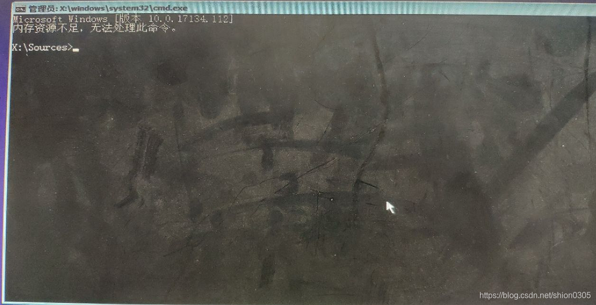
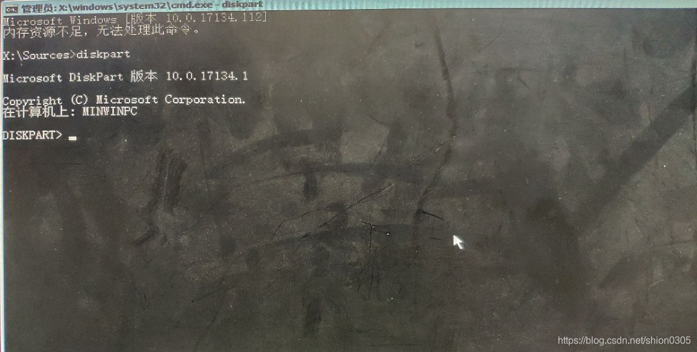
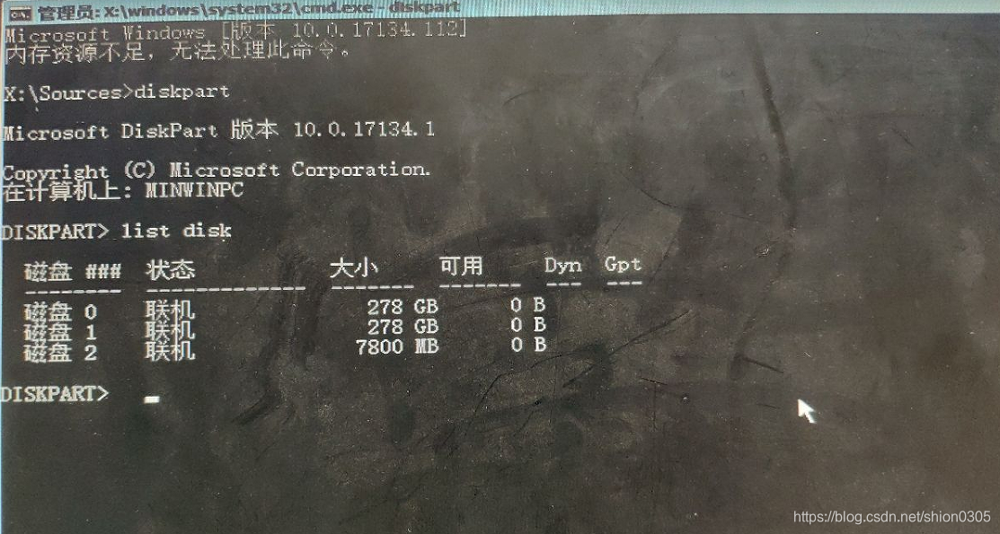
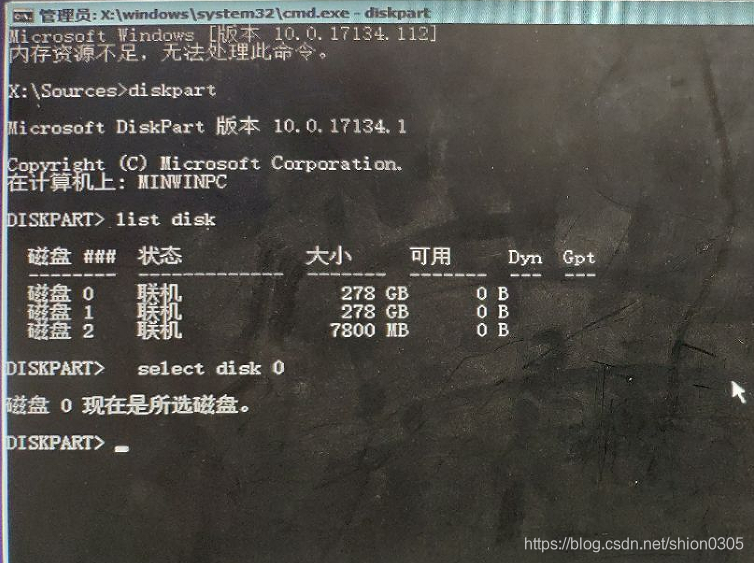
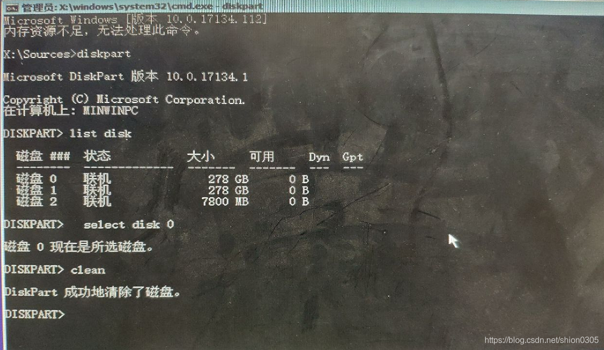

## **问题现象 & 问题原因**

有时候，一些小公司为了减少成本，会购买或使用一些二手的服务器，这些服务器可能在其他的地方被安装过其他的 Linux 操作系统，这个时候，我们拿过来服务器再去给他重装 ESXi 系统的时候，ESXi 会检查到硬盘上有其他的 Linux 分区，从而报这个错误：`Parted Util failed with message: Error: Can't have a partition outside the disk!`

## **解决方法**

碰到这种情况，我们需要做的就是把硬盘上的分区信息擦除一下，然后再安装就好了。

但ESXi似乎本身不支持此类操作，所以需要我们先通过其他方式擦除一下硬盘上的安装信息。

我们可以找一个 Windows 的安装盘，用U盘引导启动

进入启动界面之后，按 `Shift + F10` 唤出命令行操作界面

{: width="1176" height="603" .w-80 .shadow}

输入`diskpart`，进入 Windows 自带的磁盘管理工具中

{: width="1152" height="582" .w-80 .shadow}

输入`list disk`，列出当前机器上挂载的硬盘状态

{: width="1113" height="595" .w-80 .shadow}

从上面列出的信息中，我们可以看到磁盘 0 和磁盘 1 是 300G 的磁盘，是我们需要安装 ESXi 系统的磁盘，但是可用为 0B，说明磁盘已经被使用，上面有其他信息。我们需要将这些信息清空，才能继续安装 ESXi 系统

我们要清空磁盘0的话，输入`select disk 0`

{: width="754" height="563" .w-80 .shadow}

再输入`clean`命令

{: width="1163" height="676" .w-80 .shadow}

这样就把磁盘 0 清空了，这时候再输入 `list disk` 就能看到磁盘 0 可用已经变成了 278GB。

然后退出 Windows 的安装系统，再重新安装 ESXi 系统就可以正常安装了。
