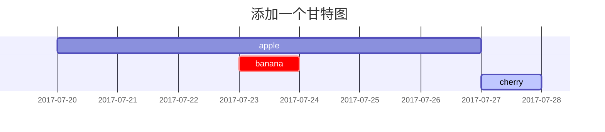
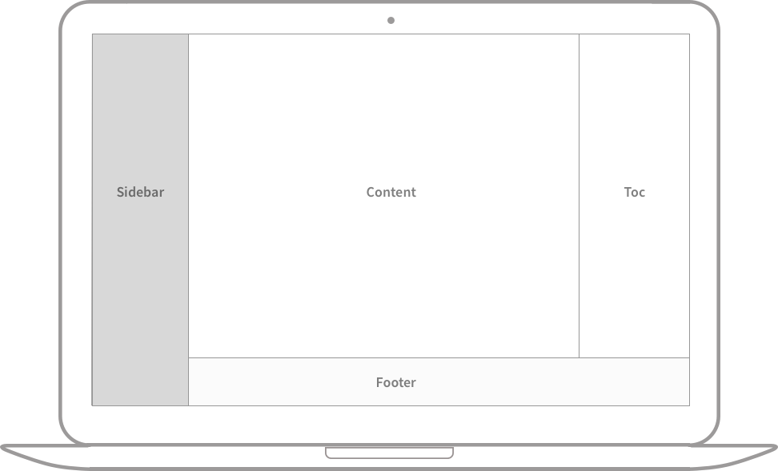

## 1. 命名和路径

创建一个名为 YYYY-MM-DD-TITLE.EXTENSION 的新文件并将其放在根目录的 _posts 中。请注意， EXTENSION 必须是 md 和 markdown 之一。如果您想节省创建文件的时间，请考虑使用插件 Jekyll-Compose 来完成此操作。

## 2. 头信息

基本上，您需要在帖子顶部填写以下[头信息](https://jekyllrb.com/docs/front-matter/)：

```yaml
---
layout: post
title: 文章的名称
description: 对文章内容的描述
author: default  # 帖子的作者信息通常不需要在 头信息 中填写，默认情况下会从配置文件中 social.name 变量和 social.links 的第一个条目中获取。如果这里要指定作者信息的话，请参看 1.1 节的内容。
date: YYYY-MM-DD HH:MM:SS +/-TTTT】，时区的格式为+/-TTTT，例如东八区为+0800，举例：2024-06-28 10:09:00 +0800
categories: [一级分类, 二级分类]  # 分类最多包含两个元素，也就是说最多 2 级分类。
tags: [TAG1, TAG2]     # TAG 的名称应始终小写，tag 元素的数量可以从 0 到无穷大。
pin: true  # 钉到首页
math: true  # 数学功能，出于网站性能原因，默认情况下不会加载数学功能。要使用数学功能，需要如此配置。
mermaid: true  # 图表生成工具，默认不开启，要使用图表功能，需要如此配置。
toc: true  # 打开当前帖子的目录功能。
comments: false  # 为当前帖子关闭评论功能
img_path: # 图片路径
image:   # 会在标题右侧显示一张预览图，进入帖子后，图片也会显示在顶部。
  path: ../assets/img/postsimages/2024-06-28-【测试】语法规则/DB9CA11B-D765-4C56-9FC8-F5FE1BEEC9C6_4_5005_c.jpeg  # 直接使用图片路径
  lqip: #可以跟图片的路径，也可以用 base64 的 URI 来展示图片
  alt: 测试预览图片  # 图片的说明
---
```

> 帖子的 *layout* 已默认设置为 `post` ，因此无需在头信息块中添加变量 *layout*。
{: .prompt-tip }

### 2.1. 作者信息

在 `_data/authors.yml`{: .filepath} 中添加作者信息（如果您的网站没有此文件，请立即创建一个）。

```yaml
<author_id>:
  name: <full name>
  twitter: <twitter_of_author>
  url: <homepage_of_author>
```
{: file='_data/authors.yml'}

然后用 author 指定单个条目或用 authors 指定多个条目：

```yaml
---
author: <author_id>                     # 针对单个作者
# or
authors: [<author1_id>, <author2_id>]   # 针对多个作者
---
```

话虽如此， author 也可以识别多个条目。

> 从 `_data/authors.yml`{: .filepath}  文件中读取作者信息的好处是页面将具有 `twitter:creator` 元标记，这丰富了 [Twitter Cards](https://developer.x.com/en/docs/twitter-for-websites/cards/guides/getting-started#card-and-content-attribution) ，并且有利于 SEO 。
{: .prompt-tip }

### 2.2. 时区

为了准确记录帖子的发布日期，您不仅应该设置 `_config.yml`{: .filepath} 的 `timezone` ，而且还应该在帖子头信息块的变量中提供时区。格式：`+/-TTTT` ， 例如东八区是 `+0800`。

### 2.3. 分类和标签

每个帖子的 `categories` 被设计为最多包含两个元素，并且 `tags` 的元素数量可以是零到无穷大。

```yaml
---
categories: [动物, 昆虫]
tags: [蜜蜂]
---
```

### 2.4. 目录

默认情况下，目录 （TOC） 显示在帖子的右侧面板上。如果要全局关闭它，请在 `_config.yml`{: .filepath} 文件中将 `toc` 变量的值设置为 `false` 。如果要关闭特定帖子的目录，请将以下内容添加到帖子的 头信息 内容中：

```yaml
---
toc: false
---
```

### 2.5. 评论

评论的全局切换由 `_config.yml`{: .filepath} 文件中的 `comments.active` 变量定义。为此变量选择评论系统后，系统将为所有帖子启用评论。

如果要关闭特定帖子的评论，请将以下内容添加到帖子的 头信息 中：

```yaml
---
comments: false
---
```

> 如果全局关闭了评论，是不能为指定帖子打开评论功能的。
{: .prompt-tip }

### 2.6. 数学

出于网站性能原因，默认情况下不会加载数学功能。但它可以通过以下方式启用：

```yaml
---
math: true
---
```

### 2.7. Mermaid图表

[Mermaid](https://github.com/mermaid-js/mermaid) 是一个很棒的图表生成工具。要在帖子中启用它，请将以下内容添加到 YAML 块：

```yaml
---
mermaid: true
---
```

然后你可以像其他 markdown 语言一样使用它：用 ```` ```mermaid ```` 和 ```` ``` ```` 包裹图形代码。

### 2.8. 图片

#### 2.8.1. 图片路径

当帖子包含许多图片时，重复定义图片的路径将是一项耗时的任务。为了解决这个问题，我们可以在帖子的 YAML 块中定义此路径：

```yaml
---
media_subpath: /img/path/
---
```

然后，Markdown 的图片源可以直接写文件名：

```markdown

```

输出将会是：

```html

```

#### 2.8.2. 预览图片

如果要在文章顶部添加图片，请提供分辨率为 `1200 x 630` 的图片。请注意，如果图片宽高比不符合 `1.91 : 1` ，图片将被缩放和裁剪。

了解这些先决条件后，您可以开始设置图片的属性：

```yaml
---
image:
  path: /path/to/image
  alt: image alternative text
---
```

> 注意， `media_subpath` 也可以传递给预览图片，也就是说，在设置好后， `path` 属性只需要图片文件名。
{: .prompt-warning }

为了简单使用，您也可以只用 image 定义路径。

```yaml
---
image: /path/to/image
---
```

#### 2.8.3. LQIP

对于预览图片：

```yaml
---
image:
  lqip: /path/to/lqip-file # or base64 URI
---
```

对于普通图片：

```markdown
{: lqip="/path/to/lqip-file" }
```

## 3. 标题测试

示例：

# 一级标题
## 二级标题
### 三级标题
#### 四级标题
##### 五级标题
###### 六级标题

语法格式：

```markdown
# 一级标题
## 二级标题
### 三级标题
#### 四级标题
##### 五级标题
###### 六级标题
```

> 一篇文章应当只有文章标题是一级标题，底下的文章正文中的标题应该都是从二级标题开始。
{: .prompt-tip }

## 4. 段落 & 正文

IT之家 6 月 26 日消息，根据美国商标和专利局（USPTO）最新公示的清单，苹果公司获得了一项关于分布式计算系统的相关专利，介绍了一种全新的系统，可以统筹安排 Mac、iPad、iPhone 以及苹果 Vision Pro 的算力，更快、更好地共同完成某些任务。
苹果公司在专利描述中并不满足现有的分布式计算技术，勾勒了一种同时无缝使用所有设备进行计算的系统，可以动态考虑每台设备的不同功率和性能，从根本上提高处理某些任务的性能。
例如用户在 Mac 上编辑照片或者渲染 3D 视频的时候，可以调用闲置的 iPad 加快编辑、渲染速度；例如用户在 Vision Pro 场景下，可以调用 Mac 的性能来处理某些任务。
苹果公司新专利中的技术不仅能分担你的工作量，还能计算出哪些设备最适合完成哪些工作，通过动态调节更快完成用户的任务。

Quisque egestas convallis ipsum, ut sollicitudin risus tincidunt a. Maecenas interdum malesuada egestas. Duis consectetur porta risus, sit amet vulputate urna facilisis ac. Phasellus semper dui non purus ultrices sodales. Aliquam ante lorem, ornare a feugiat ac, finibus nec mauris. Vivamus ut tristique nisi. Sed vel leo vulputate, efficitur risus non, posuere mi. Nullam tincidunt bibendum rutrum. Proin commodo ornare sapien. Vivamus interdum diam sed sapien blandit, sit amet aliquam risus mattis. Nullam arcu turpis, mollis quis laoreet at, placerat id nibh. Suspendisse venenatis eros eros.

## 5. 列表

### 5.1. 有序列表

示例：

1. 第一条
   1. 第一条的第一子条
   2. 第一条的第二子条
2. 第二条
   1. 第二条的第一子条
      1. 第 2 条的第 1 子条的第 1 子条
3. 第三条

语法：

```markdown
1. 第一条
   1. 第一条的第一子条
   2. 第一条的第二子条
2. 第二条
   1. 第二条的第一子条
      1. 第 2 条的第 1 子条的第 1 子条
3. 第三条
```

### 5.2. 无序列表

示例：

- 第一条
  - 第一条的第一子条
  - 第一条的第二子条
- 第二条
  - 第二条的第一子条
    - 第 2 条的第 1 子条的第 1 子条
- 第三条

语法：

```markdown
- 第一条
  - 第一条的第一子条
  - 第一条的第二子条
- 第二条
  - 第二条的第一子条
    - 第 2 条的第 1 子条的第 1 子条
- 第三条
```

### 5.3. 待办事项

示例：

- [ ] 工作事项
  - [x] 工作事项 1
  - [x] 工作事项 2
  - [ ] 工作事项 3
- [ ] 代购列表
  - [ ] 厨具
    - [ ] 锅
    - [x] 碗
    - [ ] 瓢
    - [ ] 盆

语法：

```markdown
- [ ] 工作事项
  - [x] 工作事项 1
  - [x] 工作事项 2
  - [ ] 工作事项 3
- [ ] 代购列表
  - [ ] 厨具
    - [ ] 锅
    - [x] 碗
    - [ ] 瓢
    - [ ] 盆
```

### 5.4. 描述列表

示例：

太阳
: 地球环绕的恒星

月亮
: 地球的天然卫星，通过太阳反射光可见

语法：

```markdown
太阳
: 地球环绕的恒星

月亮
: 地球的天然卫星，通过太阳反射光可见
```

## 6. 引用块

示例：

> 这里显示一个饮用块

语法：

```markdown
> 这里显示一个饮用块
```

## 7. 提示块

`提示块` 示例：

> 显示 `tip` 类型的例子。
> 
> 这里会显示一些提示信息
{: .prompt-tip }

语法：
```markdown
> 显示 `tip` 类型的例子。
> 
> 这里会显示一些提示信息
{: .prompt-tip }
```
`信息块` 示例：

> 显示 `info` 类型的例子。
> 
> 这里会显示普通信息
{: .prompt-info }

语法：

```markdown
> 显示 `info` 类型的例子。
> 
> 这里会显示普通信息
{: .prompt-info }
```

`告警块` 示例：

> 显示 `warning` 类型的例子。
> 
> 这里会显示一些告警信息
{: .prompt-warning }

语法：

```markdown
> 显示 `warning` 类型的例子。
> 
> 这里会显示一些告警信息
{: .prompt-warning }
```

`警告块` 示例：

> 显示 `danger` 类型的例子。
> 
> 这里会显示一些警告信息
{: .prompt-danger }

语法：

```markdown
> 显示 `danger` 类型的例子。
> 
> 这里会显示一些警告信息
{: .prompt-danger }
```

## 8. 表格

示例：

| Company                      | Contact          | Country |
| :--------------------------- | :--------------- | ------: |
| Alfreds Futterkiste          | Maria Anders     | Germany |
| Island Trading               | Helen Bennett    |      UK |
| Magazzini Alimentari Riuniti | Giovanni Rovelli |   Italy |

语法：

```markdown
| Company                      | Contact          | Country |
| :--------------------------- | :--------------- | ------: |
| Alfreds Futterkiste          | Maria Anders     | Germany |
| Island Trading               | Helen Bennett    |      UK |
| Magazzini Alimentari Riuniti | Giovanni Rovelli |   Italy |
```

## 9. 连接

示例：

直接连接：<http://127.0.0.1:4000>

语法：

```markdown
直接连接：<http://127.0.0.1:4000>
```

示例：

将连接附在文字上：欢迎光临[我的博客](https://shawnlyu1990.github.io)

语法：

```markdown
将连接附在文字上：欢迎光临[我的博客](https://shawnlyu1990.github.io)
```

## 10. 脚注标记

示例：

点击将会跳转到第一个脚注[^footnote]，点这儿会跳转到第二个脚注[^fn-nth-2]。

语法：

```markdown
点击将会跳转到第一个脚注[^footnote]，点这儿会跳转到第二个脚注[^fn-nth-2]。
```

## 11. 行内代码

示例：

这里会显示一个行内代码`hello world`。

语法：

```markdown
这里会显示一个行内代码`hello world`。
```

## 12. 文件路径

示例：

这是一个文件`../assets/img/postsimages/2024-06-28-【测试】语法规则/DB9CA11B-D765-4C56-9FC8-F5FE1BEEC9C6_4_5005_c.jpeg`{: .filepath}。

语法：

```markdown
这是一个文件`../assets/img/postsimages/2024-06-28-【测试】语法规则/DB9CA11B-D765-4C56-9FC8-F5FE1BEEC9C6_4_5005_c.jpeg`{: .filepath}。
```

## 13. 代码块

### 13.1. 普通代码块

示例：

```text
这是一个普通代码块，没有语法高亮，也没有行号。
This is a common code snippet, without syntax highlight and line number.
```

语法：

````markdown
```text
这是一个普通代码块，没有语法高亮，也没有行号。
This is a common code snippet, without syntax highlight and line number.
```
````

### 13.2. 指定语言

示例：

```bash
# 这是一个 bash 语言的代码块
if [ $? -ne 0 ]; then
  echo "The command was not successful.";
  #do the needful / exit
fi;
```

语法：

````markdown
```bash
# 这是一个 bash 语言的代码块
if [ $? -ne 0 ]; then
  echo "The command was not successful.";
  #do the needful / exit
fi;
```
````

### 13.3. 显示某个文件的内容，代码块上方显示文件名

示例：

```sass
@import
  "colors/light-typography",
  "colors/dark-typography";
```
{: file='_sass/jekyll-theme-chirpy.scss'}

````markdown
```sass
@import
  "colors/light-typography",
  "colors/dark-typography";
```
{: file='_sass/jekyll-theme-chirpy.scss'}
````

### 13.4. 行号

默认情况下，除 plaintext 、 console 和 terminal 之外的所有语言都将显示行号。如果要隐藏代码块的行号，请将 nolineno 类添加到其中：

````markdown
```shell
echo 'No more line numbers!'
```
{: .nolineno }
````

### 13.5. Liquid 代码

如果要显示 Liquid 代码片段，请在 liquid 代码两边加上 `` 和 `` ：

````markdown

```liquid

  This product's title contains the word Pack.

```

````

或添加 `render_with_liquid: false` （需要 Jekyll 4.0 或更高版本）到帖子的 YAML 块中。

## 14. 数学公式

数学能力由[**MathJax**](https://www.mathjax.org/)提供支持:

$$
\begin{equation}
  \sum_{n=1}^\infty 1/n^2 = \frac{\pi^2}{6}
  \label{eq:series}
\end{equation}
$$

我们可以使用\eqref{eq:series}方法引用这个公式

当 $a \ne 0$ 时，$ax^2 + bx + c = 0$ 有两个解，它们是

$$ x = {-b \pm \sqrt{b^2-4ac} \over 2a} $$

上面这一段的语法如下：

```markdown
数学能力由[**MathJax**](https://www.mathjax.org/)提供支持:

$$
\begin{equation}
  \sum_{n=1}^\infty 1/n^2 = \frac{\pi^2}{6}
  \label{eq:series}
\end{equation}
$$

我们可以使用\eqref{eq:series}方法引用这个公式

当 $a \ne 0$ 时，$ax^2 + bx + c = 0$ 有两个解，它们是

$$ x = {-b \pm \sqrt{b^2-4ac} \over 2a} $$
```

## 15. 图表

示例：



语法：

````markdown

````

## 14. 图片

### 14.1. 图序

将斜体添加到图片的下一行，然后它将成为标题并出现在图片的底部

{: width="972" height="589" }
_全屏宽度并且居中显示_

语法如下：

```markdown
{: width="972" height="589" }
_全屏宽度并且居中显示_
```

### 14.2. 图片大小

为了防止页面内容布局在加载图片时移动，我们应该设置每个图片的宽度和高度：

```markdown
{: width="700" height="400" }
```

从 Chirpy v5.0.0 开始，支持缩写（height → h， width → w）。以下示例具有与上述相同的效果：

```markdown
{: w="700" h="400" }
```

### 14.3. 图片位置

默认情况下，图片居中，但您可以使用 normal 、 left 和 right 类之中的一个指定位置。

> 指定位置后，不应添加图片标题。
{: .prompt-warning }

#### 14.3.1. 正常位置

在下面的示例中图片将会左对齐：

示例：

{: width="972" height="589" .w-75 .normal}

语法：

```markdown
{: width="972" height="589" .w-75 .normal}
```

#### 14.3.2. 向左浮动

示例：

{: width="972" height="589" .w-50 .left}
Praesent maximus aliquam sapien. Sed vel neque in dolor pulvinar auctor. Maecenas pharetra, sem sit amet interdum posuere, tellus lacus eleifend magna, ac lobortis felis ipsum id sapien. Proin ornare rutrum metus, ac convallis diam volutpat sit amet. Phasellus volutpat, elit sit amet tincidunt mollis, felis mi scelerisque mauris, ut facilisis leo magna accumsan sapien. In rutrum vehicula nisl eget tempor. Nullam maximus ullamcorper libero non maximus. Integer ultricies velit id convallis varius. Praesent eu nisl eu urna finibus ultrices id nec ex. Mauris ac mattis quam. Fusce aliquam est nec sapien bibendum, vitae malesuada ligula condimentum.

语法：

```markdown
{: width="972" height="589" .w-50 .left}
```

#### 14.3.3. 向右浮动

示例：

{: width="972" height="589" .w-50 .right}
Praesent maximus aliquam sapien. Sed vel neque in dolor pulvinar auctor. Maecenas pharetra, sem sit amet interdum posuere, tellus lacus eleifend magna, ac lobortis felis ipsum id sapien. Proin ornare rutrum metus, ac convallis diam volutpat sit amet. Phasellus volutpat, elit sit amet tincidunt mollis, felis mi scelerisque mauris, ut facilisis leo magna accumsan sapien. In rutrum vehicula nisl eget tempor. Nullam maximus ullamcorper libero non maximus. Integer ultricies velit id convallis varius. Praesent eu nisl eu urna finibus ultrices id nec ex. Mauris ac mattis quam. Fusce aliquam est nec sapien bibendum, vitae malesuada ligula condimentum.

语法：

```markdown
{: width="972" height="589" .w-50 .right}
```

### 14.4. 深色/浅色模式 阴影

您可以使图片在深色/浅色模式下遵循主题首选项。这要求您准备两个图片，一个用于深色模式，一个用于浅色模式，然后为它们分配一个特定的类（ dark 或 light ）：

语法：

```markdown
{: .light }
{: .dark }
```

程序窗口的屏幕截图可以考虑显示阴影效果：

语法：

```markdown
{: .shadow }
```

下图的示例将根据主题偏好切换深色/浅色模式，请注意它有阴影。
{: .light .w-75 .shadow .rounded-10 w='1212' h='668' }
{: .dark .w-75 .shadow .rounded-10 w='1212' h='668' }

语法如下：

```markdown
{: .light .w-75 .shadow .rounded-10 w='1212' h='668' }
{: .dark .w-75 .shadow .rounded-10 w='1212' h='668' }
```

### 14.5. CDN URL

如果将图片托管在 CDN 上，可以通过指定 _config.yml 文件中的 img_cdn 变量来节省重复编写 CDN URL 的时间：

```yaml
img_cdn: https://cdn.com
```
{: file='_config.yml'}

指定 `img_cdn` 后，CDN URL 将被添加到以 `/` 开头的所有图片（网站头像和帖子的图片）的路径中。

例如，使用图片时：

```markdown

```

解析结果会自动在图片路径前添加 https://cdn.com CDN 前缀：

```html

```

## 15. 视频

您可以使用以下语法嵌入视频：

````markdown

```liquid

```

````

其中 `Platform` 是平台名称的小写， `ID` 是视频 ID。

下表显示了如何在给定的视频 URL 中获取我们需要的两个参数，您还可以了解当前支持的视频平台。

| 视频 URL                                                              | 平台     |           ID |
| :-------------------------------------------------------------------- | :------- | -----------: |
| https://www.youtube.com/watch?v=H-B46URT4mg                           | YouTube  |  H-B46URT4mg |
| https://www.twitch.tv/videos/1634779211                               | Twitch   |   1634779211 |
| https://www.bilibili.com/video/BV1k4421Q7z7/?spm_id_from=333.1007.0.0 | Bilibili | BV1k4421Q7z7 |

示例：



语法：

```markdown

```

## 16. 音频

If you want to embed an audio file directly, use the following syntax:

```liquid

```

Where `URL` is an URL to an audio file e.g. `/path/to/audio.mp3`.

You can also specify additional attributes for the embedded audio file. Here is a full list of attributes allowed.

- `title='Text'` — title for an audio that appears below the audio and looks same as for images
- `types` — specify the extensions of additional audio formats separated by `|`. Ensure these files exist in the same directory as your primary audio file.

Consider an example utilizing all of the above:

```liquid

```

## 17. 脚注

示例：

[^footnote]: The footnote source
[^fn-nth-2]: The 2nd footnote source

语法：

```markdown
[^footnote]: The footnote source
[^fn-nth-2]: The 2nd footnote source
```