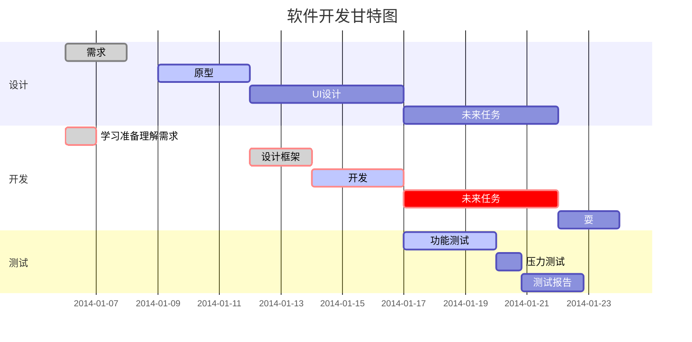
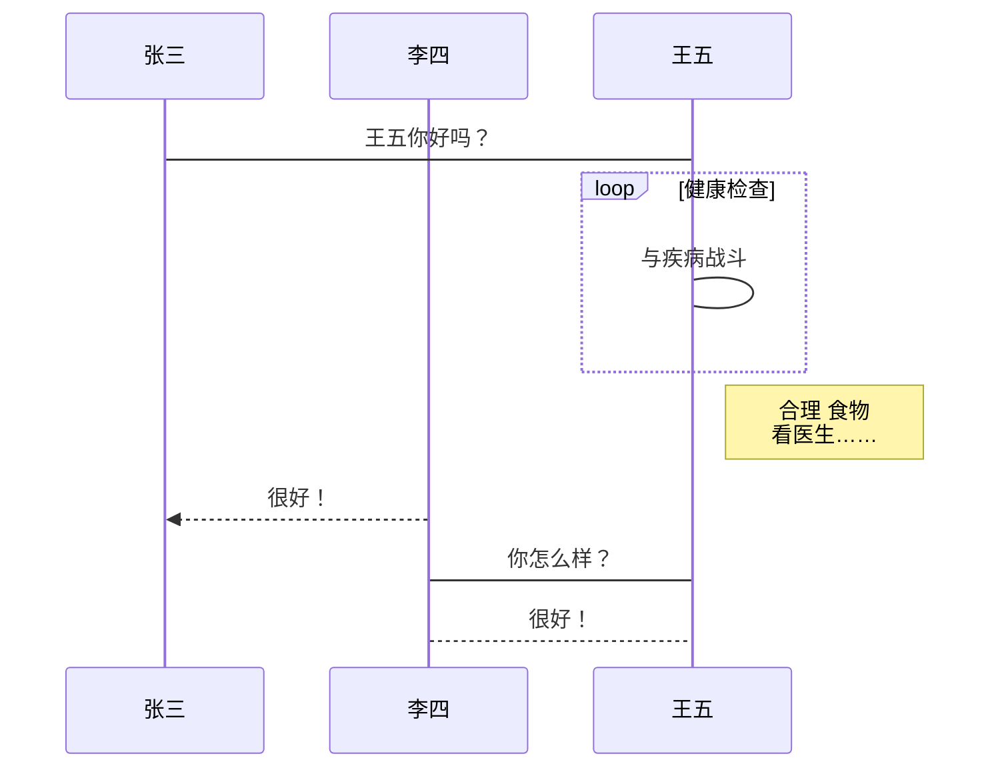

---
# 文章标题
title: Markdown 写作规范和小技巧(以Typora为例)
# 当前页面的短标题，会在导航栏、侧边栏和路径导航中作为首选。
shortTitle: Markdown 写作规范和小技巧
# 当前页面内容描述。
description: Markdown 写作规范和小技巧
# 当前页面的图标，建议填写
icon: Typora
# 作者
author: 昌霖学长
# 当前文章是否为原创
isOriginal: false
# 设置写作时间
date: 2024-07-15
# 分类，一个页面可以有多个分类
categories: 
  - Markdown
# 标签，一个页面可以有多个标签
tags: 
  - Markdown
  - Typora
  - 语法
# 页面的协议信息
license: MIT 
# 置顶标记（true/false/数字），当填入数字时，数字越大，排名越靠前。
sticky: false
# 星标（true/false/数字），当填入数字时，数字越大，排名越靠前。
star: false
# 是否将该文章添加至文章列表中。
article: true
# 是否将该文章添加至时间线中。
timeline: true
# 是否开启评论
comment: false
# 预览图。请填入绝对路径。图片路径位于 .vuepress/public 下
# cover: /assets/images/cover1.jpg
# 设置横幅图片 (宽屏分享图)，请填入绝对路径。
# banner: /assets/images/cover1.jpg
---

::: important
本博客系个人学习笔记，内容源自公开出版物及网络资源，如有侵权，请联系删除。
:::

::: info
本文中的所有示例，均以 Typora 中的显示效果为例进行截图展示，不同软件展示效果可能各有不同。
:::

## 1. 小技巧

### 1.1. kbd 语法

可以用来表示按钮或键盘按键

**显示效果**：


**代码写法**：

```markdown

按<kbd>Ctrl</kbd>+<kbd>Alt</kbd>+<kbd>Del</kbd>组合键进入登录页面。

```

### 1.2. 图片圆角加边框

**显示效果**：


**代码写法**：

```css


    
采用 HTML + CSS 语法：
style 里面是 CSS 语法，“border-radius”表示圆角大小，“border”表示边框宽度，“solid”表示实线边框，#000表示黑色
src里面是图片位置

```

### 1.3. 图片圆角加阴影

**显示效果**：


**代码写法**：

```css


采用 HTML + CSS 语法：
style 里面是 CSS 语法，“border-radius”表示圆角大小，drop-shadow(h-shadow v-shadow blur spread color)表示加阴影
    h-shadow:设置阴影的水平方向偏移量；允许负值，负值会使阴影出现在元素左边。
    v-shadow：设置阴影的垂直方向偏移量；允许负值，负值会使阴影出现在元素上方。
    blur：设置阴影的模糊度，值越大，越模糊，阴影也就会变得更大更淡；不允许负值，若未设定，默认是0 (阴影的边界很锐利)。
    spread：设置阴影的尺寸，正值会使阴影扩张和变大，负值会是阴影缩小；若未设定，默认是0 (阴影会与元素一样大小)。但是在Webkit以及其他一些浏览器中不支持spread，如果加了也不会渲染。
    color：设置阴影颜色；若未设定，颜色值基于浏览器，建议设置颜色。
src里面是图片位置。

```

### 1.4. 文字居中加粗小号（可用于图序，表序等）

**显示效果**：


**代码写法**：

```html

<center><b><small>图1：aaa</small></b></center>

采用HTML语法：
<center>表示居中
<b>表示加粗
<small>表示小号字

```

## 2. Markdown 基本语法

### 2.1. 标题

::: md-demo 标题

# 一级标题
## 二级标题
### 三级标题
#### 四级标题
##### 五级标题
###### 六级标题

:::

### 2.2. 段落 & 正文

#### 2.2.1. 段内换行

标准 Markdown 不支持此功能。

在 Typora 中，可以在结尾使用两个及以上空格加回车来实现。

#### 2.2.2. 开启新段落

在标准 Markdown 中，开启新段落需要与上一个段落中间空一行。如果不空行，则默认表示不分段。但是如果段间有多个空行，在显示时也不会体现出来。

不过，不同的软件的预览效果也不一样。比如 VScode，段与段之间不管是空 1 行还是空 N 行，预览的时候显示效果都一样。但是 Typora就不一样了，空 1-2 行，预览的时候是空 1 行的效果，空 3 行以上，预览的时候段与段之间就会添加明显的间隔。

具体用哪个软件请以那个软件的显示效果为准。

**显示效果**：


**代码写法**：

```markdown
这是第一行   
这是第二行（与第一行之间没有空行）

这是第三行（与第二行之间有 1 个空行）


这是第四行（与第三行之间有 3 个空行）
```

### 2.3. 字体效果

|       代码写法       |      显示效果      | 备注                                     |
| :------------------: | :----------------: | :--------------------------------------- |
|      `**粗体**`      |      **粗体**      | 无                                       |
|       `*斜体*`       |       *斜体*       | 无                                       |
|     `~~删除线~~`     |     ~~删除线~~     | 无                                       |
|    `***斜粗体***`    |    ***斜粗体***    | 无                                       |
| `**~~粗体删除线~~**` | **~~粗体删除线~~** | 无                                       |
|      `==高亮==`      |      ==高亮==      | 非标准 Markdown 语法，仅在部分应用中支持 |
|     `内容^上标^`     |        x^2^        | 非标准 Markdown 语法，仅在部分应用中支持 |
|     `内容~下标~`     |       CO~2~        | 非标准 Markdown 语法，仅在部分应用中支持 |

### 2.4. 列表

#### 2.4.1. 有序列表

**显示效果**：


**代码写法**：

```markdown
1. 第一条
   1. 第一条的第一子条
   2. 第一条的第二子条
2. 第二条
   1. 第二条的第一子条
      1. 第 2 条的第 1 子条的第 1 子条
3. 第三条
```

#### 2.4.2. 无序列表

**显示效果**：


**代码写法**：

```markdown
- 第一条
  - 第一条的第一子条
  - 第一条的第二子条
- 第二条
  - 第二条的第一子条
    - 第 2 条的第 1 子条的第 1 子条
- 第三条
```

#### 2.4.3. 待办事项

**显示效果**：


**代码写法**：

```markdown
- [ ] 工作事项
  - [x] 工作事项 1
  - [x] 工作事项 2
  - [ ] 工作事项 3
- [ ] 代购列表
  - [ ] 厨具
    - [ ] 锅
    - [x] 碗
    - [ ] 瓢
    - [ ] 盆
```

### 2.5. 引用块

**显示效果**：


**代码写法**：

```markdown
> 这里显示一个引用块
>
> 这是引用块的第二行
>
> > 引用块里嵌套一个引用块
```

### 2.6. Github 风格提示块（GFM）

标准 Markdown 中没有此类，但各个不同的软件可能有相应的语法支持。

以下以 Typora 为例，Typora 从 1.8 版本开始支持 Github 风格的 Alter/Callouts。使用 blockquote 突出显示「注意」和「警告」的方式。

**显示效果**：


**代码写法**：

```markdown
> [!NOTE]  
> 强调用户在浏览时应考虑的信息。

> [!TIP]
> 可选信息，可帮助用户更成功。

> [!IMPORTANT]  
> 用户成功所必需的关键信息。

> [!WARNING]  
> 由于潜在风险，需要用户立即注意的关键内容。

> [!CAUTION]
> 行动的负面潜在后果。
```

### 2.7. 表格

**显示效果**：


**代码写法**：

```markdown
| 表头1 | 表头2 | 表头3 |
| ----- | ----- | ----- |
| 内容1 | 内容2 | 内容3 |
| 内容1 | 内容2 | 内容3 |
```

#### 2.7.1. 普通表格

**显示效果**：


**代码写法**：

```markdown
| 序号 | 标题 | 网址                |
| ---- | ---- | ------------------- |
| 01   | 博客 | https://cnblogs.com |
| 02   | 百度 | https://baidu.com   |
```

#### 2.7.2. 表格对齐

**显示效果**：


**代码写法**：

```markdown
| 左对齐 | 居中对齐 |              右对齐 |
| :----- | :------: | ------------------: |
| 01     |   博客   | https://cnblogs.com |
| 02     |   百度   |   https://baidu.com |
```

#### 2.7.3. 表格使用其他标记

**显示效果**：


**代码写法**：

```markdown
| 序号   | 标题                                           | 网址                |
| ------ | ---------------------------------------------- | ------------------- |
| **01** | [博客](https://cnblogs.com)                    | https://cnblogs.com |
| *02*   | [百度](https://baidu.com "百度一下，你就知道") | https://baidu.com   |
```

### 2.8. 连接

#### 2.8.1. 网址链接

**显示效果**：


**代码写法**：

```markdown
直接连接：<http://127.0.0.1:4000>
```

#### 2.8.2. 文字链接

**显示效果**：


**代码写法**：

```markdown
将连接附在文字上：欢迎光临[我的博客](https://shawnlyu1990.github.io)
```

#### 2.8.3. 引用链接

**显示效果**：


**代码写法**：

```markdown
[百度][baidu]
[baidu]: https://baidu.com "百度一下，你就知道"
```

### 2.9. 行内代码

**显示效果**：


**代码写法**：

```markdown
这里会显示一个行内代码`hello world`。
```

### 2.10. 代码块

#### 2.10.1. 普通代码块

**显示效果**：


**代码写法**：

````markdown
```text
这是一个普通代码块，没有语法高亮，也没有行号。
This is a common code snippet, without syntax highlight and line number.
```
````

#### 2.10.2. 指定语言

**显示效果**：


**代码写法**：

````markdown
```bash
# 这是一个 bash 语言的代码块
if [ $? -ne 0 ]; then
  echo "The command was not successful.";
  #do the needful / exit
fi;
```
````

### 2.11. 数学公式

标准 Markdown 语法不支持，但不同的应用软件对数学公式的支持有所不同。

现在大部分应用支持的都是 LaTeX 的数学公式。

这里仍以 Typora 为例。

#### 2.11.1. 行内公式

语法是使用 `$` 把数学公式包裹起来。

**显示效果**：


**代码写法**：

```markdown
分数： $f(x,y) = \frac{x^2}{y^3}$

开根号： $f(x,y) = \sqrt[n]{x{^2}{^3}}$

省略号： $f(x_1, x_2, \ldots, x_n) = x_1 + x_2 + \cdots + x_n$
```

#### 2.11.2. 块间公式

语法是使用两个 `$$` 包裹数学公式

**显示效果**：


**代码写法**：

```markdown
$$
\begin{equation}
  \sum_{n=1}^\infty 1/n^2 = \frac{\pi^2}{6}
\end{equation}
$$

当 $a \ne 0$ 时，$ax^2 + bx + c = 0$ 有两个解，它们是

$$ x = {-b \pm \sqrt{b^2-4ac} \over 2a} $$
```

::: tip
更多的LaTeX数学公式请参考：<https://www.luogu.com.cn/blog/IowaBattleship/latex-gong-shi-tai-quan>。
:::

### 2.12. 图表

标准 Markdown 语法不支持，但不同的应用软件对图表的支持有所不同。

现在大部分应用支持的都是 Mermaid 图表。

这里仍以 Typora 为例。

#### 2.12.1. 横向流程图

**显示效果**：


**代码写法**：

````markdown
​```mermaid
flowchart LR
    A[方形] --> B(圆角矩形)
    B --> C{条件a}
    C -->|a=1| D[结果1]
    C -->|a=2| E[结果2]
​```
````

#### 2.12.2. 竖向流程图

**显示效果**：


**代码写法**：

````markdown
​```mermaid
flowchart TD
    A[方形] --> B(圆角矩形)
    B --> C{条件a}
    C -->|a=1| D[结果1]
    C -->|a=2| E[结果2]
​```
````

#### 2.12.3. 甘特图

**显示效果**：


**代码写法**：

````markdown

````

#### 2.12.4. UML 标准时序图

时序图中，`->` 代表直线，`-->` 代表虚线，`->>` 代表实线箭头，`-->>`代表虚线箭头

**显示效果**：


**代码写法**：

````markdown

````

::: tip
更多 mermaid 语法请参考 <https://mermaid.js.org/syntax/flowchart.html>
:::

### 2.13. 图片

**代码写法**：

```markdown

```

### 2.14. 目录

标准 Markdown 语法不支持，但不同的应用软件对目录的支持有所不同。

语法说明如下。

1. TOC是Table of Contents的缩写。 
2. 在想插入目录的位置输入[TOC]，按回车键后就可以自动生成文章的目录了。 直接输入[TOC]标记已经很简便了，可如果我们忘记了语法，也可以执行：菜单栏→【段落】→【内容目录】。 效果如下图所示。

**代码写法**：

```markdown
[TOC]
```

### 2.15. 转义

当我们想在 Markdown 文件中插入一些标记符号，但又不想让这些符号被渲染时，可以使用 `\` 进行转义，语法如下。

**代码写法**：

```markdown
\特殊符号
```

可被转义的特殊符号如下。

::: info
以下符号均为英文符号，中文符号不需要转义
:::

| 特殊符号 |       说明       |
| :------: | :--------------: |
|    \\    |      反斜杠      |
|    \`    |      反引号      |
|    \*    |       星号       |
|    \_    |      下划线      |
|   \{\}   |      花括号      |
|   \[\]   |      方括号      |
|   \(\)   |       括号       |
|    \#    |       井号       |
|    \+    |       加号       |
|    \-    |  减号（短横线）  |
|    \.    | 点号（英文句号） |
|    \!    |      感叹号      |

### 2.16. 表情符号

非标准 Markdown 语法，仅在部分应用中支持。

在大多数情况下，您可以简单地从 [Emojipedia](https://emojipedia.org/) 等来源复制表情符号并将其粘贴到文档中。许多 Markdown 应用程序会自动以 Markdown 格式的文本显示表情符号。从 Markdown 应用程序导出的 HTML 和 PDF 文件应显示表情符号。

一些 Markdown 应用程序允许您通过键入表情符号短代码来插入表情符号。这些以冒号开头和结尾，并包含表情符号的名称。

|     语法     |    效果    |
| :----------: | :--------: |
|  `:smile:`   |  :smile:   |
| `:laughing:` | :laughing: |
|    `:+1:`    |    :+1:    |
|    `:-1:`    |    :-1:    |
|   `:clap:`   |   :clap:   |

::: tip
更多的表情符号请参考<https://gist.github.com/rxaviers/7360908>
:::

### 2.17. 锚点

非标准 Markdown 语法，仅在部分应用中支持。

网页中，锚点其实就是页内超链接，也就是链接本文档内部的某些元素，实现当前页面中的跳转。

**代码写法**：

```markdown
[回到标题](#markdown基本语法)
```

### 2.18. 分割线

1. 分隔线须使用至少3个以上的`*`/`-`/`_`来标记。
2. 行内不能有其他的字符。
3. 可以在标记符中间加上空格。
4. 上下最好都留一个空行。

**显示效果**：


**代码写法**：

```markdown
线上面文字

***

线上面文字

---

线上面文字

___
```

### 2.19. 脚注

非标准 Markdown 语法，仅在部分应用中支持。

在需要添加注脚的文字后加上脚注名字`[^脚注名字]`,称为加注。 然后在文本的任意位置(一般在最后)添加脚注，脚注前必须有对应的脚注名字。

脚注与脚注之间尽量空一行。

**显示效果**：


**代码写法**：

```markdown
使用 Markdown[^1]可以效率的书写文档, 直接转换成 HTML[^2], 你可以使用 Leanote[^Le] 编辑器进行书写。

[^1]: Markdown是一种纯文本标记语言

[^2]: HyperText Markup Language 超文本标记语言

[^Le]: 开源笔记平台，支持Markdown和笔记直接发为博文
```

## 3. 参考

1. 《Markdown 官方教程》<https://markdown.com.cn/basic-syntax/>
2. 《Typora Markdown Docment》<https://github.com/deeround/Typora-Markdown-Docment>
